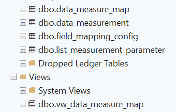
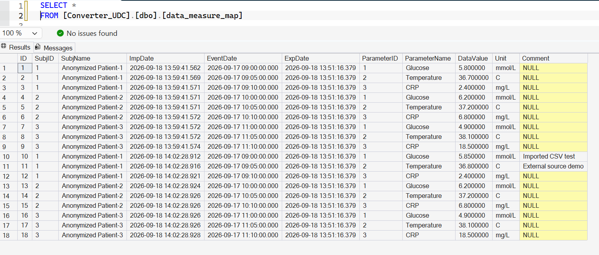
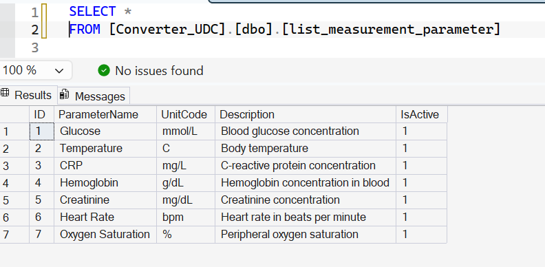

# 🗄️ Databases

This section is planned for working with **test/demo databases** to demonstrate queries,  
data modeling, and integration with applications.  

However, it is **strictly prohibited to publish or share production databases** due to confidentiality and security reasons.  
For this reason, only **test or demo databases** will be considered for inclusion here (e.g., synthetic datasets or public samples).  

## My Database Projects

The following database was developed as part of my Universal Data
Converter project. It demonstrates database design, standardized
data exchange, and integration with a Python application.

### Universal Data Converter — Database Example

Database creation and restoration resources for the
([Universal Data Converter](https://github.com/RLisovenko/UDC-UniversalDataConverter)) project.
[View database files](https://github.com/RLisovenko/UDC-UniversalDataConverter/tree/main/4_BAK_SQL_DB_UDC)
## Downloads
- [View database instructions](https://github.com/RLisovenko/UDC-UniversalDataConverter/tree/main/4_BAK_SQL_DB_UDC)
- [Database creation script](https://github.com/RLisovenko/UDC-UniversalDataConverter/tree/main/4_BAK_SQL_DB_UDC/database/Converter_NEW_UDC_full.sql)
- [Database backup](https://github.com/RLisovenko/UDC-UniversalDataConverter/tree/main/4_BAK_SQL_DB_UDC/database/Converter_UDC.bak)
## Database Preview

### Database structure

The UDC database includes measurement records, imported data,
field mapping configuration, a parameter catalog, and an export view.

### Imported data — `dbo.data_measure_map`

Stores imported records in a standardized format: subject identifier,
measurement date, parameter, value, unit, and comment.
Import and export timestamps help track data exchange.

### Parameter catalog — `dbo.list_measurement_parameter`

Defines measurement parameters, their units, descriptions, and active
status. Examples include glucose, temperature, CRP, and heart rate.

---

---------------
## ⚠️ Important:  Third-Party Sample Databases

The databases listed below are publicly available examples created
by their respective authors and vendors. I am not their original
developer.

They are referenced here for learning, SQL practice, and exploration
of database design. Ownership and licensing remain with the original
authors.

This section is separate from my own UDC database project above.  

---------------

# 📌 Example Databases

## 🔹 Microsoft SQL Server (MSSQL)
| Database        | Description                                                                 | Link |
|-----------------|-----------------------------------------------------------------------------|------|
| **Northwind**   | Classic sample database with customers, orders, products, and suppliers. Ideal for learning queries and joins. | [GitHub - Northwind](https://github.com/microsoft/sql-server-samples/tree/main/samples/databases/northwind-pubs) |
| **AdventureWorks** | Enterprise-level demo database covering sales, HR, production, and finance. Great for complex query practice and reporting. | [GitHub - AdventureWorks](https://github.com/microsoft/sql-server-samples/releases/tag/adventureworks) |

## 🔹 PostgreSQL
| Database      | Description                                                                 | Link |
|---------------|-----------------------------------------------------------------------------|------|
| **DVD Rental** | Movie rental store example with tables for films, actors, customers, and rentals. Good for practicing transactions and joins. | [PostgreSQL Tutorial - DVD Rental](https://www.postgresqltutorial.com/postgresql-sample-database/) |

## 🔹 MySQL
| Database      | Description                                                                 | Link |
|---------------|-----------------------------------------------------------------------------|------|
| **Sakila**     | Sample database modeling a DVD rental system, similar to PostgreSQL’s DVD Rental, but designed for MySQL. | [MySQL Documentation - Sakila](https://dev.mysql.com/doc/sakila/en/) |
| **Employees**  | HR-focused database containing employees, salaries, departments, and job history. Excellent for practicing aggregation and subqueries. | [MySQL Documentation - Employees](https://dev.mysql.com/doc/employee/en/) |

---

📌 They are well-known **demo databases from official vendors**.  
They are included here to show how SQL queries, reporting, and analytics can be practiced safely.  

---

At the moment, this section remains **under consideration and development**.  
Future updates may include:  
- Small demo databases for practicing SQL queries.  
- Example schemas for analytics and reporting.  
- Test data for integration with scripts and applications.  
